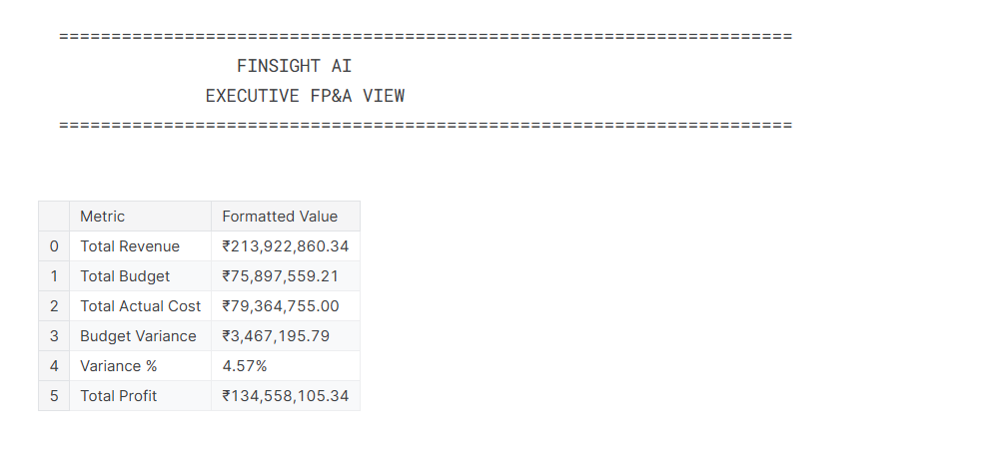
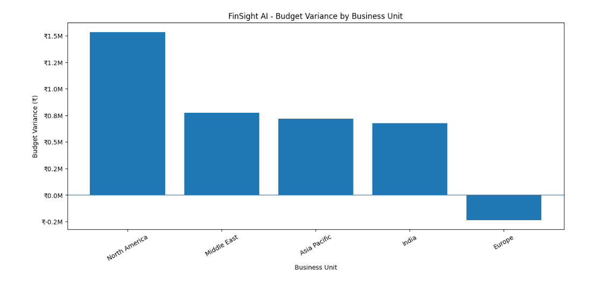
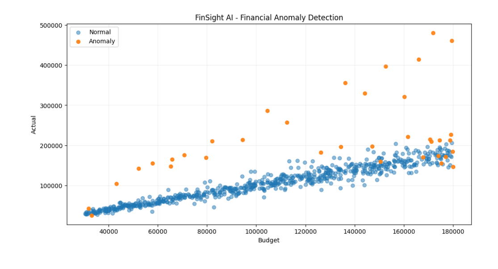
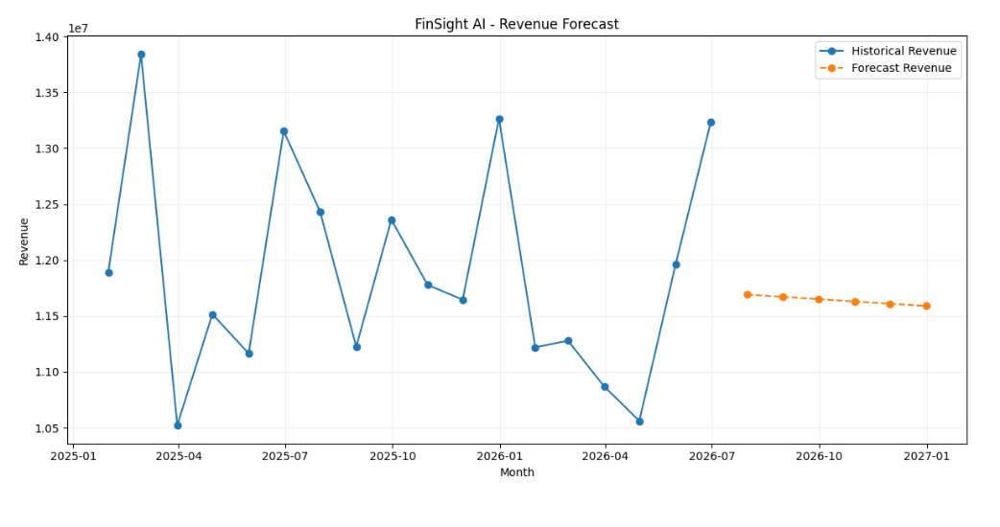
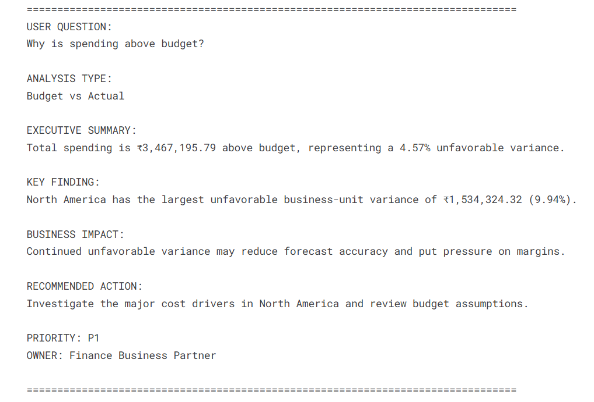

# 🚀 FinSight AI — Agentic FP&A & ERP Analytics Copilot

> AI-powered financial analytics combining Finance, Python, SQL, Machine Learning, Data Visualization and Product Management.

## 📌 Project Overview

FinSight AI is an agentic FP&A analytics prototype designed to help finance teams move faster from:

**Financial Data → Evidence → Insight → Action**

The system accepts natural-language finance questions and routes them to the appropriate analytical capability.

### Example questions

- Why is spending above budget?
- Which cost drivers need attention?
- Which financial transactions look unusual?
- What is the revenue outlook?

---

## 🎯 Business Problem

FP&A and finance teams frequently spend significant time transforming ERP-style financial data into:

- Budget vs Actual analysis
- Variance explanations
- Cost-driver analysis
- Financial risk identification
- Revenue forecasts
- Management recommendations

FinSight AI demonstrates how an agentic analytics workflow can streamline this process.

---

## 🏗️ Architecture
                         USER
                           │
                           ▼
               Natural Language Question
                           │
                           ▼
                    Finance Agent
                           │
             ┌─────────────┼─────────────┐
             ▼             ▼             ▼
           SQL            ML        Forecasting
           Tool           Tool          Tool
             │             │             │
             └─────────────┼─────────────┘
                           ▼
                    Verified Evidence
                           │
                           ▼
                  AI Reasoning Layer
                           │
                           ▼
                  Business Insight
                           │
                           ▼
                 Recommended Action
                           │
                    ┌──────┴──────┐
                    ▼             ▼
                 Priority        Owner

**🧠 Key Capabilities**

| Capability           | Technology                      |
| -------------------- | ------------------------------- |
| Budget vs Actual     | SQL + Python                    |
| Variance Analysis    | Python + SQL                    |
| Cost Driver Analysis | SQL                             |
| Anomaly Detection    | Scikit-learn / Isolation Forest |
| Revenue Forecasting  | Linear Regression               |
| Data Visualization   | Matplotlib                      |
| Finance Agent        | Python                          |
| AI-style Reasoning   | Structured reasoning layer      |
| PM Action Tracking   | Priority + Owner + Status       |

**🛠️ Technology Stack**
Python
Pandas
NumPy
SQLite
SQL
Scikit-learn
Matplotlib
Machine Learning
Agentic AI
FP&A Analytics
Product Management

**📊 Dataset**

The project uses a synthetic ERP-style financial dataset.

The dataset contains:

Transaction IDs
Business Units
Departments
Financial Accounts
Budgets
Actual Spending
Revenue
Variance
Variance %
Profit

No confidential employer, client or customer data is used.

**🔎 Business Scenario**
The synthetic dataset intentionally contains realistic financial patterns:

North America → Cloud Infrastructure overspend
Asia Pacific → Professional Services spike
Europe → Travel underspend
India → relatively stable Payroll
Middle East → Marketing variance

The dataset also includes unusual transactions for machine-learning anomaly detection.

**🤖 Agent Workflow**

A user can ask:

"Why is spending above budget?"

The agent identifies the appropriate analytical workflow, retrieves financial evidence using SQL, and produces a structured management response.

The response contains:

**Executive Summary
Key Finding
Business Impact
Recommended Action
Priority
Owner**

**📈 Analytics Workflow**

1. Financial Data
Synthetic ERP-style transactions are generated using Python.

2. SQL Analysis
SQL queries calculate:
Budget
Actual
Variance
Variance %
Business-unit performance
Cost drivers

3. Machine Learning
Isolation Forest identifies potentially unusual transactions.

4. Forecasting
A baseline regression model generates a six-month revenue forecast.

5. Agentic Reasoning
The finance agent determines which analytical capability should be used for a natural-language question.

6. Management Action
Analytical findings are translated into:

Business impact
Recommended action
Priority
Owner

**📸 Project Preview**

### Executive FP&A Dashboard

### Business Unit Budget Variance

### ML-Based Financial Anomaly Detection

### Revenue Forecast

### 🤖 AI Finance Copilot

The system accepts natural-language finance questions and routes them to the appropriate analytical workflow before generating a structured management recommendation.

## 🔗 Project Links

### Kaggle Notebook

[Open FinSight AI on Kaggle](https://www.kaggle.com/code/isharma04/finsight-ai-agentic-fpa-copilot)

**📁 Repository Structure**
finsight-ai-agentic-fpa-copilot/
│
├── README.md
├── notebooks/
│   └── finsight_ai_agentic_fpa_copilot.ipynb
│
├── src/
│   ├── finance_agent.py
│   └── analytics_tools.py
│
├── data/
│   └── synthetic_erp_financials.csv
│
└── requirements.txt

**⚠️ Limitations**

This is a portfolio prototype rather than a production financial system.

Current limitations include:

Synthetic dataset
Baseline revenue forecasting model
ML anomaly results require business validation
Current reasoning layer does not depend on a paid external LLM API
Production deployment would require authentication, governance, monitoring and ERP integration

**🔮 Future Roadmap**
Version 2
LLM-powered natural-language interface
Natural-language-to-SQL with query validation
ERP API integration
Scenario and What-if analysis
Margin forecasting
Working-capital analytics
Automated management reporting
Human approval workflow for AI recommendations

**👤 About**

This project combines my interests and experience across:
Finance & FP&A + Data Analytics + Python + SQL + AI + Product Management
The goal is to demonstrate how AI can help finance professionals move faster from:

Data → Evidence → Insight → Action

**📄 Disclaimer**

This project is for educational and portfolio demonstration purposes. Financial data is synthetic and does not represent any real company or client.
